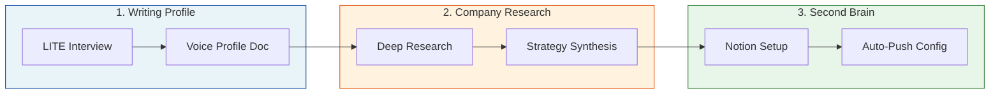

# Workshop Exercises

Three hands-on exercises that build on each other. Start with your own voice, apply it to company research, then make your insights persistent.

---

## Exercise Overview

| # | Exercise | What You Build | Time |
|---|----------|----------------|------|
| 1 | [Writing Profile](./writing-profile/) | Personal voice profile for AI writing | 15-20 min |
| 2 | [Company Research](./company-research/) | Executive-ready company briefing + strategy synthesis | 30 min |
| 3 | [Second Brain](./second-brain/) | Claude-Notion integration for persistent knowledge | 15-25 min |

**Total time:** 60-75 minutes

---

## Recommended Order

**Why this order:**

1. **Writing Profile first** — Your voice profile can inform how AI writes research outputs and summaries
2. **Company Research second** — Produces substantive insights worth capturing
3. **Second Brain last** — Now you have content to push and a system to maintain it

---

## Exercise Details

### 1. Writing Profile (15-20 min)

Capture your writing DNA through a 10-question interview. The output is a reusable voice profile document.

**Files:**
- `lite-interview.md` — The interview prompt (start here)
- `question-analysis.md` — Why these 10 questions were chosen
- `platform-guide.md` — Platform-specific setup instructions

**Output:** `voice-profile.md` you can attach to future AI sessions

---

### 2. Company Research (30 min)

Run AI-powered research on a company (yours, a competitor, or a prospect). Transform raw research into structured strategy frameworks.

**Files:**
- `01-deep-research.md` — Research prompt and protocol
- `02-strategy-synthesis.md` — Golden Circle + BMC + VPC synthesis

**Output:** Executive briefing + strategy document with citations

---

### 3. Second Brain (15-25 min)

Connect Claude to Notion so insights persist beyond chat sessions. Configure auto-push for different work modes.

**Files:**
- `claude-notion-setup.md` — Initial connection walkthrough
- `auto-push-project.md` — Project instructions for automatic capture

**Output:** Working Claude-Notion integration with knowledge capture protocol

---

## Skip Paths

Short on time? Pick one:

| Time Available | Do This |
|----------------|---------|
| **15 min** | Writing Profile only — immediately usable |
| **30 min** | Company Research only — most standalone value |
| **45 min** | Writing Profile + Company Research |
| **60+ min** | All three (recommended) |

---

## After the Workshop

- Save your voice profile somewhere accessible (GitHub, Notion, local folder)
- Use the research protocol on your next prospect or competitor
- Test the Notion integration with a real capture before you forget the setup
