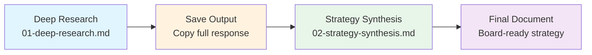

# Company Research Exercise

**Two-part exercise that builds AI-assisted research muscle.**

Transform scattered web intelligence into a structured strategy document in under 45 minutes.

---

## What This Teaches

| Skill | Why It Matters |
|-------|----------------|
| Prompt engineering for research | Most people get shallow results because they ask shallow questions |
| Source triangulation | AI can hallucinate; you need citation discipline |
| Framework application | Raw data is useless without structure (Golden Circle, BMC, VPC) |
| Two-stage AI workflow | Research and synthesis require different tools and prompts |

---

## Workflow

**Critical:** Save your research output before starting synthesis. The second prompt requires the first output as input.

---

## Time Estimates

| Phase | Duration | Notes |
|-------|----------|-------|
| **Part 1: Deep Research** | 25-30 min | Includes quick scan + full protocol |
| **Handoff** | 2 min | Copy and save research output |
| **Part 2: Strategy Synthesis** | 10-15 min | Single prompt, review and validate |
| **Total** | ~45 min | First time; gets faster with practice |

---

## Platform Recommendations

### Part 1: Deep Research

| Recommended | Also Works | Avoid |
|-------------|------------|-------|
| **Perplexity Pro** | ChatGPT with browsing | Base Claude (no web access) |

Perplexity Pro is the default because:
- Real-time web search
- Automatic inline citations
- Source links for verification
- Fast iteration on follow-up questions

### Part 2: Strategy Synthesis

Any capable LLM works. The synthesis prompt is framework-heavy, not research-heavy.

| Platform | Notes |
|----------|-------|
| **Claude** | Best for structured, long-form output |
| **ChatGPT** | Solid alternative |
| **Perplexity** | Works, but overkill since no web search needed |

---

## Exercise Files

1. **[01-deep-research.md](./01-deep-research.md)** - Research protocol with prompts for quick scan and full analysis
2. **[02-strategy-synthesis.md](./02-strategy-synthesis.md)** - Framework synthesis (Golden Circle + BMC + VPC)

---

## Quick Start

1. Open Perplexity Pro
2. Copy the Quick Start prompt from `01-deep-research.md`
3. Replace `[COMPANY NAME]` with your target
4. Run and iterate
5. Save the full output
6. Open Claude or ChatGPT
7. Paste your research output + the prompt from `02-strategy-synthesis.md`
8. Review and validate the strategy document

---

## Expected Outputs

### After Part 1
- Executive summary (1 page)
- Products table
- Competitor matrix
- Risk flags with evidence
- Citation trail

### After Part 2
- Executive maxim (1 sentence thesis)
- Golden Circle (Why/How/What)
- Business Model Canvas (9 blocks)
- Value Proposition Canvas (Jobs/Pains/Gains + Fit Statement)

---

## Common Pitfalls

| Mistake | Fix |
|---------|-----|
| Skipping Part 1, going straight to synthesis | Garbage in, garbage out. The synthesis prompt needs real research. |
| Not saving Part 1 output | You'll lose it when you start Part 2. Copy before switching. |
| Accepting uncited claims | Push back: "Cite sources for the revenue estimate." |
| Using synthesis output without validation | The AI structures; you verify. Check the TBD items. |
