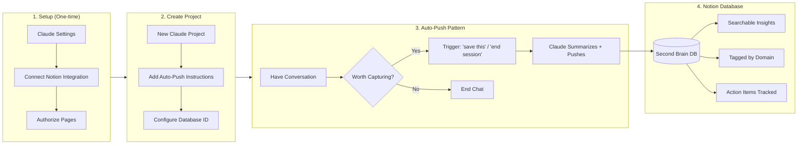

# Second Brain Exercise: Claude + Notion Integration

Build external memory that captures insights automatically. No more losing good ideas to chat history.

---

## What You're Building

A knowledge capture system where Claude:
1. Connects to your Notion workspace
2. Reads existing notes for context
3. Auto-pushes valuable insights at end of conversations
4. Structures everything consistently for retrieval

**Why this matters:** Most knowledge management dies from friction. This removes the friction.

---

## System Flow



---

## Time Estimates

| Phase | Duration | Notes |
|-------|----------|-------|
| Notion connection setup | 10-15 min | One-time |
| Project configuration | 10 min | Per project, reusable template |
| **Total initial setup** | **20-25 min** | Then zero friction ongoing |

---

## Prerequisites

| Requirement | Why |
|-------------|-----|
| **Claude Pro or Max** | Free tier lacks MCP integrations |
| **Notion account** | Free tier works; any paid tier also works |
| **Desktop browser** | Mobile not supported for initial setup |

---

## Exercise Files

| File | Purpose | Time |
|------|---------|------|
| [claude-notion-setup.md](./claude-notion-setup.md) | Connect Claude to Notion (one-time) | 10-15 min |
| [auto-push-project.md](./auto-push-project.md) | Configure auto-capture project | 10 min |

**Do them in order.** Setup first, then project configuration.

---

## Quick Start

1. **Setup connection** — Follow `claude-notion-setup.md` to authorize Claude
2. **Create Notion database** — Use schema from `auto-push-project.md`
3. **Create Claude project** — Paste the capture instructions
4. **Test** — Have a conversation, say "save this", verify it lands in Notion

---

## What Success Looks Like

After setup, your workflow becomes:

```
You: [Have substantive conversation with Claude]
You: "Save this to Notion"
Claude: [Summarizes key insights, pushes to database, confirms]
```

Every valuable conversation becomes a searchable, tagged entry in your second brain. No copy-paste. No reformatting. No friction.
