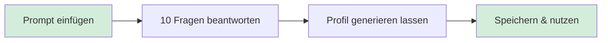

# Übung: Schreibprofil erstellen

> Eine AI interviewt dich zu deinem Schreibstil. Am Ende hast du ein Dokument, das jeder AI beibringt, wie du klingst.

**Dauer:** 20 Minuten

---

## Los geht's

1. Öffne [lite-interview.md](./lite-interview.md)
2. Kopiere den gesamten Prompt
3. Öffne eine neue Konversation in [Claude](https://claude.ai) (oder ChatGPT, falls du kein Claude hast)
4. Füge den Prompt ein und drücke Enter
5. Beantworte die 10 Fragen — ehrlich und konkret, nicht poliert
6. Speichere das generierte Profil am Ende

**Wichtig:** Die AI stellt dir eine Frage nach der anderen. Nimm dir Zeit. Vage Antworten wie "Ich halte es gerne einfach" produzieren generische Profile. Konkrete Beispiele und echte Ärgernisse sind das, was zählt.

---

## Was du am Ende hast

- **Stimmprofil-Dokument** — Kernidentität, verbotene Wörter, tonale Marker
- **Kurzreferenz** — Immer / Niemals / Stimmkalibrierung
- **Sofort einsetzbar** — als Projektanweisung in Claude oder Custom Instructions in ChatGPT hinterlegen

---

## Tipps

- **Claude Pro:** Erstelle ein Projekt namens "Schreibprofil" und füge den Prompt in die Projektanweisungen ein — so bleibt alles erhalten
- **ChatGPT:** Starte einen neuen Chat und füge den Prompt direkt ein
- **Spracheingabe:** Funktioniert gut — sprich deine Antworten, statt zu tippen
- Details zur Einrichtung auf verschiedenen Plattformen: [platform-guide.md](./platform-guide.md)

---

## Für Neugierige: Das vollständige Interview

Die 10 Fragen decken alle sieben Kategorien des Frameworks ab und liefern ca. 80% des Signals in 20% der Zeit.

Wer tiefer einsteigen will — z.B. für einen dauerhaften Schreibassistenten oder hochvolumige Inhaltserstellung — kann das vollständige 100-Fragen-Interview durchführen:

1. Mache zuerst die LITE-Version (oben)
2. Nutze dann [bridge-to-full.md](./bridge-to-full.md) für den Übergang
3. Zeitaufwand: 60–90 Minuten zusätzlich

| Variante | Zeit | Abdeckung |
|----------|------|-----------|
| **LITE (diese Übung)** | 20 Min. | ~80% des Signals |
| **Vollständig** | 90 Min. | ~95% des Signals |

Für die meisten reicht LITE. Abnehmende Erträge sind real.
