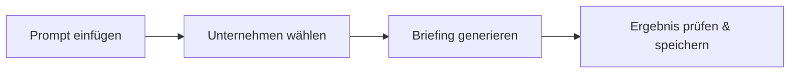

# Übung: Unternehmensrecherche

> In 20 Minuten ein Unternehmens-Briefing erstellen, das du in einem Kundengespräch oder einer Vorstandssitzung verwenden könntest.

**Dauer:** 20 Minuten (+ optionaler Bonus)

---

## Los geht's

### 1. Wähle dein Unternehmen

| Option | Wann sinnvoll |
|--------|---------------|
| **Dein eigenes Unternehmen** | Wie sieht der Markt dich? Blinde Flecken in der Positionierung? |
| **Ein Wettbewerber** | Deren Strategie, Preise, Schwächen |
| **Ein Kunde oder Prospect** | Pain Points, Entscheidungskriterien, Budgetsignale |

### 2. Öffne Claude oder dein bevorzugtes AI-Tool

Gehe zu [claude.ai](https://claude.ai) und starte eine neue Konversation. Claude Pro hat Websuche eingebaut — das reicht. Alternativ funktioniert auch Perplexity Pro oder ChatGPT.

### 3. Kopiere den Prompt

Öffne [01-deep-research.md](./01-deep-research.md) und kopiere den Prompt. Ersetze die drei Platzhalter (`[COMPANY NAME]`, `[INDUSTRY]`, `[COUNTRY/REGION]`) mit deinem Zielunternehmen.

> **Der Prompt ist auf Englisch** — das liefert bessere Rechercheergebnisse. Die AI antwortet auf Deutsch.

### 4. Prüfe das Ergebnis

Du erhältst ein strukturiertes Briefing mit Quellenangaben. Prüfe:
- Stimmen die Fakten? (Klicke auf die Quellen)
- Fehlt etwas Wichtiges?
- Sind Schätzungen als solche markiert?

> **Tipp:** Falls der Output zu oberflächlich ist, frag nach: *"Geh tiefer auf [Abschnitt]. Belege mit mindestens 3 Quellen."*

### 5. Speichere dein Ergebnis

Kopiere das vollständige Briefing in einen Texteditor oder ein Dokument. Du brauchst es für den optionalen Bonus-Schritt.

---

## Was du am Ende hast

- **Executive Summary** — teilbar mit der Führungsebene
- **Produktetabelle** — Stärken, Schwächen, Pricing auf einen Blick
- **Wettbewerbermatrix** — Positionierung im Markt
- **Risikohinweise** — mit Quellenbelegen
- **Zitationsnachweis** — jede Aussage durch 1+ Quellen gestützt

---

## Bonus: Strategie-Synthese (nach dem Kurs)

Wenn du dein Recherche-Ergebnis in ein vorstandsreifes Strategiedokument verwandeln willst:

1. Öffne Claude oder ChatGPT
2. Füge dein Recherche-Ergebnis ein
3. Füge den Prompt aus [02-strategy-synthesis.md](./02-strategy-synthesis.md) darunter ein
4. Du erhältst: Golden Circle + Business Model Canvas + Value Proposition Canvas

Zeitaufwand: 10-15 Minuten zusätzlich. Lohnt sich, wenn du das Unternehmen wirklich verstehen willst.
