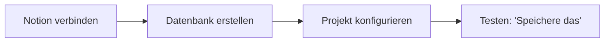

# Übung: Second Brain mit Claude + Notion

> Baue ein System, das deine Erkenntnisse aus Claude-Gesprächen automatisch in Notion speichert. Kein Copy-Paste, keine Reibung.

**Dauer:** 20 Minuten



---

## Los geht's

### 1. Claude mit Notion verbinden

Folge der Anleitung in [claude-notion-setup.md](./claude-notion-setup.md). Am Ende hast du Claude mit deinem Notion-Workspace verbunden.

> **Voraussetzung:** Claude Pro und ein Notion-Konto (kostenlose Version reicht).

### 2. Notion-Datenbank erstellen

Öffne eine neue Claude-Konversation und sag:

> «Erstelle mir eine Second-Brain-Datenbank in Notion mit Feldern für Titel, Datum, Kernerkenntnisse, Quelle, Tags, Aktionspunkte und Konfidenz. Gib mir die Datenbank-ID.»

Claude erstellt die Datenbank und gibt dir die ID. **Kopiere diese ID.**

### 3. Claude-Projekt einrichten

Folge der Anleitung in [auto-push-project.md](./auto-push-project.md). Du erstellst ein Claude-Projekt mit Anweisungen, die automatisch Erkenntnisse in dein Notion speichern.

### 4. Testen

Führe ein kurzes Gespräch in deinem neuen Projekt. Am Ende sag:

> «Speichere das in Notion.»

Prüfe in Notion, ob der Eintrag erscheint.

---

## Was du am Ende hast

```
Du: [Führst ein Gespräch mit Claude]
Du: «Speichere das in Notion»
Claude: [Fasst zusammen, speichert in Datenbank, bestätigt]
```

Jedes wertvolle Gespräch wird zu einem durchsuchbaren, getaggten Eintrag in deinem Second Brain. Kein Kopieren. Keine Reibung.

---

## Übungsdateien

| Datei | Zweck | Zeit |
|-------|-------|------|
| [claude-notion-setup.md](./claude-notion-setup.md) | Claude mit Notion verbinden (einmalig) | 10 Min. |
| [auto-push-project.md](./auto-push-project.md) | Auto-Erfassungsprojekt konfigurieren | 10 Min. |

**Reihenfolge:** Zuerst Setup, dann Projekt.
