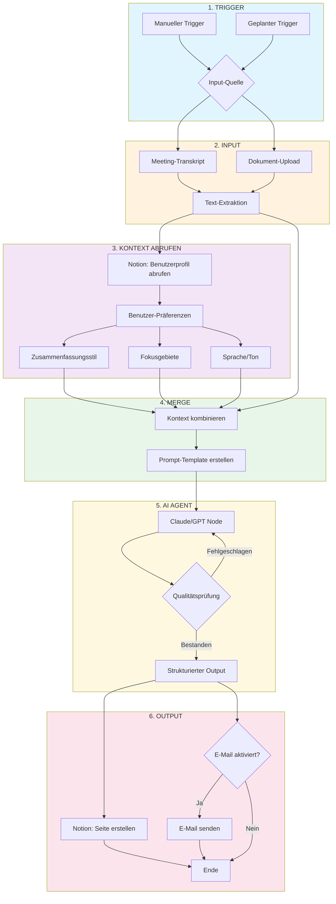

# GAMMA-Prompt: Demo Personalisierter Zusammenfassungs-Workflow

**Segment:** 06 - Demo: Personalisierter Zusammenfassungs-Workflow
**Dauer:** 15 Minuten (inkl. Q&A)

---

## Folie 1: Titelfolie

**Titel:** Personalisierter Zusammenfassungs-Workflow
**Untertitel:** Von rohen Meeting-Notizen zu verwertbarer Intelligenz

**Visueller Vorschlag:** Split-Screen-Icon mit unordentlichem Dokument links, sauberer Aufzählungs-Zusammenfassung rechts

**Sprechernotizen:**
> „Jede Führungskraft, die ich kenne, hat das gleiche Problem: Sie verlassen ein Meeting, Ihre Notizen existieren irgendwo, und dann... nichts. Sie verrotten. Dieser Workflow verwandelt rohe Meeting-Inhalte in etwas, das Sie tatsächlich lesen würden – formatiert so, wie *Sie* es wollen, fokussiert auf das, was *Ihnen* wichtig ist."

---

## Folie 2: Das Problem

**Titel:** Meeting-Notizen sterben auf drei Arten

**Kernpunkte:**
- Zu lang zum Wiederlesen
- Falsches Format für Ihre Arbeitsweise
- Kein System liefert sie dorthin, wo Sie sie brauchen

**Visueller Vorschlag:** Drei Icons, die jeden Fehlermodus darstellen (Dokumentenstapel, Format-Mismatch-Symbol, unterbrochene Zustellungskette)

**Sprechernotizen:**
GPT kann alles zusammenfassen. Aber eine Zusammenfassung, die niemand liest, ist wertlos. Personalisierung ist der Unterschied zwischen „funktioniert" und „nützlich".

---

## Folie 3: Die Architektur

**Titel:** Wie der Workflow zusammenpasst

**Visueller Vorschlag:** Dieses Mermaid-Diagramm als primäres Visual einbinden:

**Sprechernotizen:**
Beachten Sie das Pattern: Trigger, Input, Kontext, Merge, AI, Output. Die zentrale Erkenntnis ist der *Merge*-Node – Präferenzen sind nicht eingebacken. Sie werden bei jeder Ausführung frisch abgerufen. Sie können 50 verschiedene Personen mit einem Workflow bedienen.

---

## Folie 4: Das Benutzerprofil

**Titel:** Personalisierung lebt in Notion

**Kernpunkte:**
- Zusammenfassungsstil: Aufzählungspunkte vs. Prosa
- Fokusgebiete: Umsatz, Entscheidungen, Blocker
- Tonpräferenz: Direkt, formell, konversationell
- Zustellungskanal: Notion, E-Mail, Slack

**Visueller Vorschlag:** Screenshot-Mockup einer Notion-Datenbank mit sichtbaren Profilfeldern

**Sprechernotizen:**
Das ist keine Konfiguration, die im Code vergraben ist. Es ist eine Notion-Datenbank, die Sie jederzeit aktualisieren. Meinung geändert? Feld ändern. Der Workflow passt sich an. Der CEO bekommt strategische Aufzählungspunkte. Der PM bekommt Action Items. Der Analyst bekommt volle Details.

---

## Folie 5: Live-Demo - Der Flow

**Titel:** Beobachten Sie die Ausführung

**Kernpunkte:**
| Node | Was passiert |
|------|--------------|
| Trigger | Manuell, geplant oder Webhook-gesteuert |
| Input | Rohes Transkript kommt ins System |
| Context Fetch | Benutzerprofil wird aus Notion abgerufen |
| Merge | Transkript trifft auf Präferenzen |
| AI Agent | Prompt wird aus Profil konstruiert, nicht hartcodiert |
| Output | Zusammenfassung landet in Notion + optionale E-Mail |

**Visueller Vorschlag:** Animiertes Flow-Diagramm oder Screenshot des n8n-Canvas mit hervorgehobenem Ausführungspfad

**Sprechernotizen:**
Beachten Sie, dass das Profil *zuerst* abgerufen wird, bevor irgendetwas anderes passiert. Kontext zuerst, dann Aktion. Der Prompt wird *konstruiert*, nicht geschrieben. Stil, Fokus, Länge – alles aus Ihrem Profil injiziert.

---

## Folie 6: Der Output

**Titel:** Was gerade angekommen ist

**Kernpunkte:**
- Zusammenfassung entspricht dem gewünschten Stil
- Fokusgebiete hervorgehoben
- Ton konsistent mit Präferenz
- Metadaten erfasst: Quelle, Datum, verknüpfter Benutzer

**Visueller Vorschlag:** Screenshot einer Notion-Seite mit sauberer Aufzählungs-Zusammenfassung und Metadaten-Sidebar

**Sprechernotizen:**
Gleicher Inhalt, andere Person, anderer Output. Das ist es, was „personalisiert" tatsächlich bedeutet. Wir ändern eine Präferenz und führen erneut aus, um es zu beweisen.

---

## Folie 7: Design-Prinzipien

**Titel:** Warum dieses Pattern funktioniert

**Kernpunkte:**
- **Trennung der Verantwortlichkeiten** — Benutzer-Präferenzen in Notion, Logik in n8n, AI macht einen Job
- **Runtime statt Build Time** — Präferenzen werden bei jeder Ausführung frisch abgerufen
- **Auditierbar** — Jede Zusammenfassung mit Quellenreferenz gespeichert
- **Erweiterbar** — Slack, Teams, CRM, Sprachausgabe hinzufügen

**Visueller Vorschlag:** Drei-Spalten-Diagramm mit Notion (Daten), n8n (Logik), AI (Verarbeitung) als separate Schichten

**Sprechernotizen:**
No-Code bedeutet nicht No-Architecture. Das sieht einfach aus, aber es ist designt. Der Merge-Node ist kein Zufall – das ist das Pattern. Jedes Teil ist austauschbar.

---

## Folie 8: Gleiches Pattern, viele Anwendungen

**Titel:** Wo funktioniert das sonst noch?

**Kernpunkte:**

| Input-Quelle | Anwendungsfall |
|--------------|----------------|
| E-Mail-Weiterleitung | Newsletter automatisch zusammenfassen |
| Slack-Nachricht | Team-Update-Digest |
| RSS-Feed | Branchen-News-Briefing |
| Kalender-API | Pre-Meeting-Kontextvorbereitung |

| Output-Ziel | Anwendungsfall |
|-------------|----------------|
| Todoist/Things | Action Items extrahieren |
| CRM-Notiz | Kunden-Meeting-Log |
| Sprache (ElevenLabs) | Beim Pendeln anhören |

**Visueller Vorschlag:** Hub-and-Spoke-Diagramm, das einen Workflow zeigt, der mehrere Inputs und Outputs verbindet

**Sprechernotizen:**
Sie lernen nicht einen Workflow – Sie lernen ein Pattern. Trigger, Input, Kontext, Merge, AI, Output. Wenden Sie es überall an.

---

## Folie 9: Der Business Case

**Titel:** Einmal bauen, für immer sparen

**Kernpunkte:**
- Bauzeit: Ein Nachmittag
- Betriebskosten: 5 CHF/Monat VPS (oder kostenlose Stufe)
- Zeitersparnis: 20 Min./Meeting x 10 Meetings/Woche x 50 Wochen = **160+ Stunden/Jahr**

**Visueller Vorschlag:** Einfache ROI-Rechner-Grafik oder Zeit-Geld-Vergleichsdiagramm

**Sprechernotizen:**
Was ist Ihr Stundensatz? Multiplizieren Sie das mit 160 Stunden. Das ist der Wert einer Nachmittagsarbeit. Und das ist nur *ein* Workflow.

---

## Folie 10: Diskussion

**Titel:** Sie sind dran

**Kernpunkte:**
- Welche Inhalte generieren oder empfangen Sie, die diese Behandlung gebrauchen könnten?
- Wo sterben Zusammenfassungen in Ihrer Organisation gerade?
- Was würden Sie in *Ihr* persönliches Profil aufnehmen?
- Wer in Ihrem Team braucht ein anderes Output-Format?

**Visueller Vorschlag:** Einfaches Fragezeichen-Icon oder Diskussions-Bubble-Grafik

**Sprechernotizen:**
Tiefgehende technische n8n-Fragen für den Workshop parken – wir bauen gemeinsam in der Hands-on-Session. Jetzt: Denken Sie an *Ihren* Anwendungsfall.

---

## GAMMA-Generierungshinweise

- **Stil:** Professionell, minimal, tech-orientiert
- **Farbpalette:** Abgestimmt auf Mermaid-Diagramm-Farben (Blautöne, Orange, Violett, Grüntöne)
- **Typografie:** Klare Sans-Serif, hoher Kontrast
- **Übergänge:** Einfach halten – der Inhalt ist die Show, nicht die Animation
- **Gesamtfolien:** 10 (passt in 15-Minuten-Segment mit Live-Demo-Zeit)
