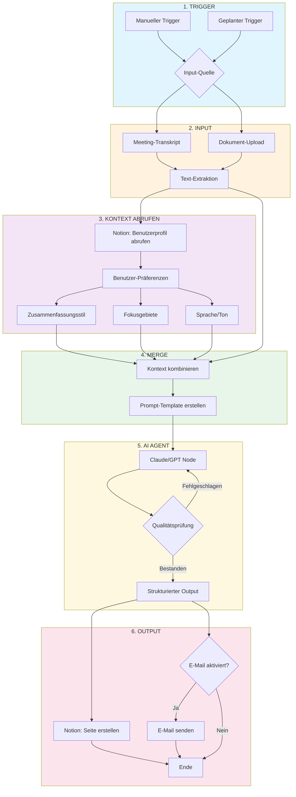

# n8n Workflow: Personalisierter Zusammenfassungs-Agent

## Workflow-Diagramm



---

## Node-Referenz

| # | Node | Zweck | Wichtige Konfiguration |
|---|------|-------|------------------------|
| 1 | **Trigger** | Startet den Workflow | Manueller Button oder Cron-Zeitplan |
| 2 | **Input** | Empfängt Rohinhalte | Webhook, Datei-Upload oder Einfügen |
| 3 | **Notion Get** | Ruft Benutzerprofil ab | Datenbank-ID + Benutzer-ID-Filter |
| 4 | **Merge** | Kombiniert Transkript + Präferenzen | Expression: `{{ $json.transcript }}` + `{{ $('Notion').item.json }}` |
| 5 | **AI Agent** | Verarbeitet mit LLM | System-Prompt mit Persona + Benutzer-Präferenzen |
| 6a | **Notion Create** | Schreibt Zusammenfassung | Zieldatenbank + Property-Mapping |
| 6b | **Email** | Optionale Benachrichtigung | Bedingt durch Benutzerpräferenz |

---

## Konfigurationshinweise

### Notion-Integration
```
Erforderliche Datenbank-Properties:
- Title (text)
- Summary (rich_text)
- Source (select)
- Created (date)
- User (relation)
```

### AI Agent Prompt-Struktur
```
SYSTEM: Sie sind ein Zusammenfassungs-Assistent. Passen Sie Ihren Output an:
- Stil: {{ $json.user.summary_style }}
- Fokus: {{ $json.user.focus_areas }}
- Länge: {{ $json.user.preferred_length }}

USER: Fassen Sie dieses Transkript zusammen:
{{ $json.transcript }}
```

### Fehlerbehandlung
- Wiederholungsschleife am AI-Node (max. 2 Versuche)
- Fallback: Rohes Transkript schreiben, falls AI versagt
- Logging: Alle Läufe in separater Notion-DB speichern

---

## Warum dieses Pattern funktioniert

1. **Trennung der Verantwortlichkeiten** - Benutzer-Präferenzen leben in Notion, nicht hartcodiert
2. **Wiederverwendbar** - Derselbe Workflow verarbeitet jeden Dokumenttyp
3. **Auditierbar** - Jede Zusammenfassung mit Quellenreferenz gespeichert
4. **Erweiterbar** - Slack, Teams oder Webhook-Outputs einfach hinzufügen

---

*Für GAMMA-Folien: Das Mermaid-Diagramm als Visual verwenden, die Tabelle als Sprechernotizen.*
