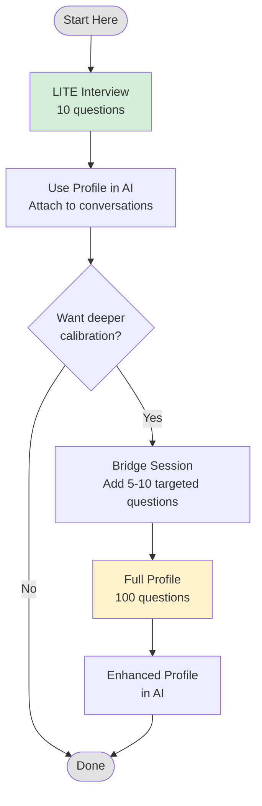

# Writing Profile Exercise

Build a personal voice profile that teaches AI to write like you.

---

## What This Is

A structured self-interview that extracts your writing DNA: beliefs, constraints, pet peeves, and patterns. The output is a markdown document you can attach to any AI conversation to get writing that sounds like you rather than generic AI slop.

**Why it works:** Most people can't articulate their own taste. They give vague answers like "I like to keep things simple." This interview framework pushes past that with specific questions designed to surface:

- Negative constraints (what you hate) over positive aspirations
- Concrete examples over abstract descriptions
- Visceral reactions over reasoned positions

---

## Pathways

---

## Time Estimates

| Path | Time | What You Get |
|------|------|--------------|
| **LITE Interview** | 15-20 min | Usable profile covering all 7 categories |
| **Bridge Session** | +10-15 min | Targeted refinements based on gaps you notice |
| **Full Profile** | 60-90 min | Comprehensive 100-question deep dive |

**Recommendation:** Start with LITE. Most people get 80% of the value in 20% of the time. Only go full profile if you're serious about AI ghostwriting or building a persistent custom GPT.

---

## Exercise Files

| File | Purpose |
|------|---------|
| [lite-interview.md](./lite-interview.md) | 10-question prompt (copy/paste ready) |
| [question-analysis.md](./question-analysis.md) | Why these 10 questions were selected |
| [platform-guide.md](./platform-guide.md) | Setup instructions for Claude, ChatGPT, Perplexity, Gemini |
| [Full Interview Prompt](../input/me-in-a-doc.md) | 100-question version for the deep dive |

---

## Expected Outcomes

After completing the LITE interview, you'll have:

1. **A Voice Profile document** with:
   - Core identity summary (2-3 sentences)
   - Full responses to all 10 questions
   - Quick reference card: Always / Never / Voice calibration

2. **Practical artifacts:**
   - Banned words list
   - At least one signature sentence example
   - Documented red flags and aesthetic crimes
   - Tonal range markers (skeptical vs. excited)

3. **Immediate usability:**
   - Drop the profile into Claude Projects or ChatGPT custom instructions
   - Reference it in any "write like me" prompt
   - Iterate as you notice gaps

---

## Quick Start

1. Open [lite-interview.md](./lite-interview.md)
2. Copy the interview prompt
3. Paste into a new AI conversation (see [platform-guide.md](./platform-guide.md) for setup)
4. Block 20 minutes
5. Answer honestly -- specific beats polished
6. Save the generated profile as `voice-profile.md`

---

## Bridge Session (Optional)

After using your LITE profile for a week, you'll notice where it's thin. Common gaps:

- Transitions between ideas
- Formatting preferences (lists vs. prose)
- Handling disagreement or controversy
- Domain-specific voice shifts

Run a targeted 5-10 question follow-up to patch these. Append to your existing profile.

---

## Full Profile

For comprehensive coverage, use the [100-question interview](../input/me-in-a-doc.md). This is overkill for most use cases but valuable if:

- You're building a persistent writing assistant
- You do significant AI-assisted content creation
- You want the process of articulating your taste (therapeutic side effect)

---

*Last updated: January 31, 2026*
