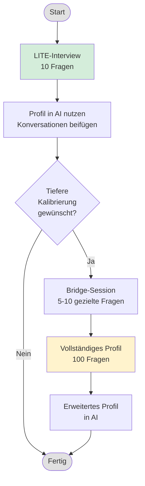

# Übung: Schreibprofil erstellen

Erstellen Sie ein persönliches Stimmprofil, das einer AI beibringt, wie Sie zu schreiben.

---

## Was ist das?

Ein strukturiertes Selbstinterview, das Ihre Schreib-DNA extrahiert: Überzeugungen, Einschränkungen, Ärgernisse und Muster. Das Ergebnis ist ein Markdown-Dokument, das Sie jeder AI-Konversation beifügen können, um Texte zu erhalten, die nach Ihnen klingen -- nicht nach generischem AI-Einheitsbrei.

**Warum es funktioniert:** Die meisten Menschen können ihren eigenen Geschmack nicht artikulieren. Sie geben vage Antworten wie "Ich halte die Dinge gerne einfach." Dieses Interview-Framework geht darüber hinaus mit spezifischen Fragen, die Folgendes ans Licht bringen:

- Negative Einschränkungen (was Sie hassen) statt positive Absichten
- Konkrete Beispiele statt abstrakter Beschreibungen
- Instinktive Reaktionen statt durchdachter Positionen

---

## Vorgehensweise

---

## Zeitaufwand

| Variante | Zeit | Ergebnis |
|----------|------|----------|
| **LITE-Interview** | 15-20 Min. | Nutzbares Profil mit allen 7 Kategorien |
| **Bridge-Session** | +10-15 Min. | Gezielte Verfeinerungen basierend auf erkannten Lücken |
| **Vollständiges Profil** | 60-90 Min. | Umfassendes 100-Fragen-Tiefeninterview |

**Empfehlung:** Beginnen Sie mit LITE. Die meisten erhalten 80% des Nutzens in 20% der Zeit. Das vollständige Profil lohnt sich nur, wenn Sie AI-Ghostwriting ernsthaft betreiben oder einen dauerhaften Custom GPT aufbauen möchten.

---

## Übungsdateien

| Datei | Zweck |
|-------|-------|
| [lite-interview.md](./lite-interview.md) | 10-Fragen-Prompt (kopierfertig) |
| [question-analysis.md](./question-analysis.md) | Warum diese 10 Fragen ausgewählt wurden |
| [platform-guide.md](./platform-guide.md) | Einrichtungsanleitung für Claude, ChatGPT, Perplexity, Gemini |
| [Vollständiger Interview-Prompt](../input/me-in-a-doc.md) | 100-Fragen-Version für die Tiefenanalyse |

---

## Erwartete Ergebnisse

Nach Abschluss des LITE-Interviews haben Sie:

1. **Ein Stimmprofil-Dokument** mit:
   - Kernidentitäts-Zusammenfassung (2-3 Sätze)
   - Vollständige Antworten auf alle 10 Fragen
   - Kurzreferenz: Immer / Niemals / Stimmkalibrierung

2. **Praktische Artefakte:**
   - Liste verbotener Wörter
   - Mindestens ein Beispiel für einen charakteristischen Satz
   - Dokumentierte Warnsignale und ästhetische Sünden
   - Tonale Marker (skeptisch vs. begeistert)

3. **Sofortige Einsatzbereitschaft:**
   - Profil in Claude Projects oder ChatGPT Custom Instructions hinterlegen
   - In jedem "Schreib wie ich"-Prompt referenzieren
   - Iterieren, wenn Lücken auffallen

---

## Schnellstart

1. Öffnen Sie [lite-interview.md](./lite-interview.md)
2. Kopieren Sie den Interview-Prompt
3. Fügen Sie ihn in eine neue AI-Konversation ein (siehe [platform-guide.md](./platform-guide.md) für die Einrichtung)
4. Blockieren Sie 20 Minuten
5. Antworten Sie ehrlich -- spezifisch schlägt poliert
6. Speichern Sie das generierte Profil als `voice-profile.md`

---

## Bridge-Session (Optional)

Nachdem Sie Ihr LITE-Profil eine Woche lang verwendet haben, werden Sie feststellen, wo es dünn ist. Häufige Lücken:

- Übergänge zwischen Ideen
- Formatierungspräferenzen (Listen vs. Fliesstext)
- Umgang mit Meinungsverschiedenheiten oder Kontroversen
- Domänenspezifische Stimmwechsel

Führen Sie ein gezieltes Follow-up mit 5-10 Fragen durch, um diese zu beheben. Fügen Sie die Ergebnisse Ihrem bestehenden Profil hinzu.

---

## Vollständiges Profil

Für umfassende Abdeckung nutzen Sie das [100-Fragen-Interview](../input/me-in-a-doc.md). Das ist für die meisten Anwendungsfälle übertrieben, aber wertvoll, wenn:

- Sie einen dauerhaften Schreibassistenten aufbauen
- Sie erhebliche AI-gestützte Inhaltserstellung betreiben
- Sie den Prozess der Geschmacksartikulation schätzen (therapeutischer Nebeneffekt)

---

*Letzte Aktualisierung: 31. Januar 2026*
