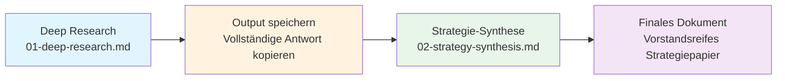

# Übung: Unternehmensrecherche

**Zweiteilige Übung zur Entwicklung von AI-gestützten Recherchefähigkeiten.**

Verwandeln Sie verstreute Web-Informationen in weniger als 45 Minuten in ein strukturiertes Strategiedokument.

---

## Was Sie lernen

| Kompetenz | Warum sie wichtig ist |
|-----------|----------------------|
| Prompt Engineering für Recherche | Die meisten erhalten oberflächliche Ergebnisse, weil sie oberflächliche Fragen stellen |
| Quellen-Triangulation | AI kann halluzinieren; Zitationsdisziplin ist unerlässlich |
| Framework-Anwendung | Rohdaten sind ohne Struktur nutzlos (Golden Circle, BMC, VPC) |
| Zweistufiger AI-Workflow | Recherche und Synthese erfordern unterschiedliche Tools und Prompts |

---

## Workflow

**Kritisch:** Speichern Sie Ihr Recherche-Output, bevor Sie mit der Synthese beginnen. Der zweite Prompt benötigt den Output des ersten als Input.

---

## Zeitschätzungen

| Phase | Dauer | Hinweise |
|-------|-------|----------|
| **Teil 1: Deep Research** | 25-30 Min. | Inklusive Schnell-Scan + vollständiges Protokoll |
| **Übergabe** | 2 Min. | Recherche-Output kopieren und speichern |
| **Teil 2: Strategie-Synthese** | 10-15 Min. | Ein Prompt, prüfen und validieren |
| **Total** | ~45 Min. | Beim ersten Mal; wird mit Übung schneller |

---

## Plattform-Empfehlungen

### Teil 1: Deep Research

| Empfohlen | Funktioniert auch | Vermeiden |
|-----------|-------------------|-----------|
| **Perplexity Pro** | ChatGPT mit Browsing | Basis-Claude (kein Web-Zugang) |

Perplexity Pro ist die Standardempfehlung, weil:
- Echtzeit-Websuche
- Automatische Inline-Zitate
- Quellenlinks zur Verifizierung
- Schnelle Iteration bei Folgefragen

### Teil 2: Strategie-Synthese

Jedes leistungsfähige LLM funktioniert. Der Synthese-Prompt ist framework-intensiv, nicht recherche-intensiv.

| Plattform | Hinweise |
|-----------|----------|
| **Claude** | Am besten für strukturierten, langen Output |
| **ChatGPT** | Solide Alternative |
| **Perplexity** | Funktioniert, aber überdimensioniert, da keine Websuche nötig |

---

## Übungsdateien

1. **[01-deep-research.md](./01-deep-research.md)** - Recherche-Protokoll mit Prompts für Schnell-Scan und Vollanalyse
2. **[02-strategy-synthesis.md](./02-strategy-synthesis.md)** - Framework-Synthese (Golden Circle + BMC + VPC)

---

## Schnellstart

1. Öffnen Sie Perplexity Pro
2. Kopieren Sie den Schnellstart-Prompt aus `01-deep-research.md`
3. Ersetzen Sie `[COMPANY NAME]` durch Ihr Zielunternehmen
4. Ausführen und iterieren
5. Vollständigen Output speichern
6. Öffnen Sie Claude oder ChatGPT
7. Fügen Sie Ihren Recherche-Output + den Prompt aus `02-strategy-synthesis.md` ein
8. Strategiedokument prüfen und validieren

---

## Erwartete Ergebnisse

### Nach Teil 1
- Executive Summary (1 Seite)
- Produktetabelle
- Wettbewerbermatrix
- Risikohinweise mit Evidenz
- Zitationsnachweis

### Nach Teil 2
- Executive Maxim (1-Satz-These)
- Golden Circle (Why/How/What)
- Business Model Canvas (9 Blöcke)
- Value Proposition Canvas (Jobs/Pains/Gains + Fit Statement)

---

## Häufige Fehler

| Fehler | Lösung |
|--------|--------|
| Teil 1 überspringen, direkt zur Synthese | Garbage in, garbage out. Der Synthese-Prompt braucht echte Recherche. |
| Teil 1 Output nicht speichern | Sie verlieren ihn, wenn Sie Teil 2 starten. Vorher kopieren. |
| Unbelegte Behauptungen akzeptieren | Nachfragen: "Belegen Sie die Umsatzschätzung mit Quellen." |
| Synthese-Output ohne Validierung verwenden | AI strukturiert; Sie verifizieren. Prüfen Sie die TBD-Punkte. |
