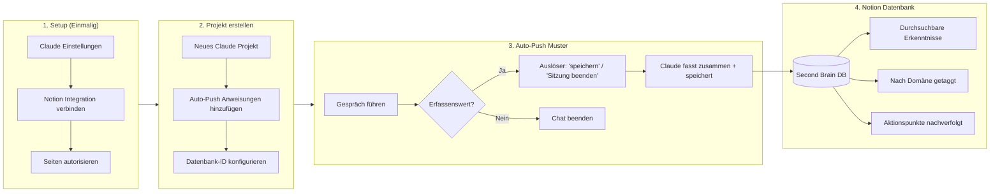

# Second Brain Übung: Claude + Notion Integration

Bauen Sie ein externes Gedächtnis auf, das Erkenntnisse automatisch erfasst. Keine wertvollen Ideen mehr, die im Chatverlauf verloren gehen.

---

## Was Sie entwickeln

Ein Wissenserfassungssystem, bei dem Claude:
1. Sich mit Ihrem Notion-Workspace verbindet
2. Bestehende Notizen als Kontext ausliest
3. Wertvolle Erkenntnisse am Ende von Gesprächen automatisch speichert
4. Alles konsistent strukturiert für späteren Abruf

**Warum das wichtig ist:** Die meisten Wissensmanagement-Systeme scheitern an der Reibung. Dieses System beseitigt diese Reibung.

---

## Systemablauf



---

## Zeitschätzungen

| Phase | Dauer | Hinweise |
|-------|-------|----------|
| Notion-Verbindung einrichten | 10-15 Min. | Einmalig |
| Projektkonfiguration | 10 Min. | Pro Projekt, wiederverwendbare Vorlage |
| **Gesamte Ersteinrichtung** | **20-25 Min.** | Danach fortlaufend ohne Reibungsverluste |

---

## Voraussetzungen

| Anforderung | Grund |
|-------------|-------|
| **Claude Pro oder Max** | Die kostenlose Version enthält keine MCP-Integrationen |
| **Notion-Konto** | Kostenlose Version funktioniert; jede Bezahlversion ebenfalls |
| **Desktop-Browser** | Mobile Geräte werden für die Ersteinrichtung nicht unterstützt |

---

## Übungsdateien

| Datei | Zweck | Zeit |
|-------|-------|------|
| [claude-notion-setup.de.md](./claude-notion-setup.de.md) | Claude mit Notion verbinden (einmalig) | 10-15 Min. |
| [auto-push-project.de.md](./auto-push-project.de.md) | Auto-Erfassungsprojekt konfigurieren | 10 Min. |

**Führen Sie diese in der richtigen Reihenfolge aus.** Zuerst das Setup, dann die Projektkonfiguration.

---

## Schnellstart

1. **Verbindung einrichten** — Folgen Sie `claude-notion-setup.de.md`, um Claude zu autorisieren
2. **Notion-Datenbank erstellen** — Verwenden Sie das Schema aus `auto-push-project.de.md`
3. **Claude-Projekt erstellen** — Fügen Sie die Erfassungsanweisungen ein
4. **Testen** — Führen Sie ein Gespräch, sagen Sie «Speichere das», überprüfen Sie, ob es in Notion erscheint

---

## Was Erfolg bedeutet

Nach der Einrichtung wird Ihr Workflow zu:

```
Sie: [Führen ein substantielles Gespräch mit Claude]
Sie: «Speichere das in Notion»
Claude: [Fasst wichtige Erkenntnisse zusammen, speichert in Datenbank, bestätigt]
```

Jedes wertvolle Gespräch wird zu einem durchsuchbaren, getaggten Eintrag in Ihrem Second Brain. Kein Kopieren und Einfügen. Keine Neuformatierung. Keine Reibung.
