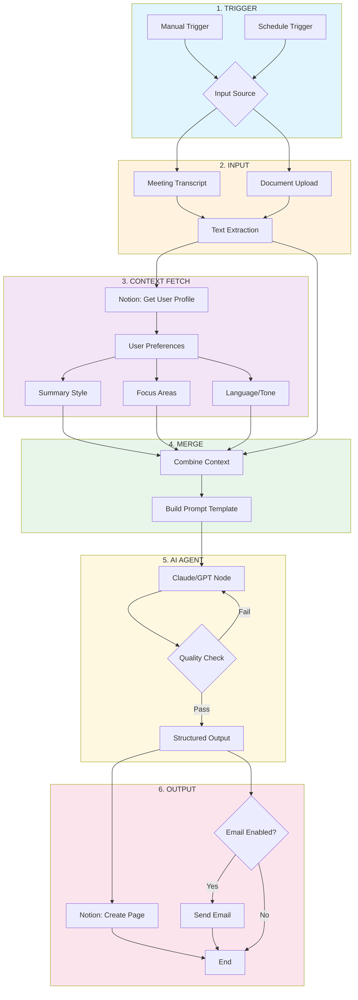

# GAMMA Prompt: Personalized Summary Workflow Demo

**Segment:** 06 - Demo: Personalized Summary Workflow
**Duration:** 15 minutes (including Q&A)

---

## Slide 1: Title Slide

**Title:** Personalized Summary Workflow
**Subtitle:** From Raw Meeting Notes to Actionable Intelligence

**Visual suggestion:** Split-screen icon showing messy document on left, clean bulleted summary on right

**Speaker notes:**
> "Every executive I know has the same problem: you leave a meeting, your notes exist somewhere, and then... nothing. They rot. This workflow turns raw meeting content into something you'd actually read — formatted the way *you* want it, focused on what *you* care about."

---

## Slide 2: The Problem

**Title:** Meeting Notes Die in Three Ways

**Key points:**
- Too long to re-read
- Wrong format for how you work
- No system delivers them where you need them

**Visual suggestion:** Three icons representing each failure mode (document stack, format mismatch symbol, broken delivery chain)

**Speaker notes:**
GPT can summarize anything. But a summary nobody reads is worthless. Personalization is the difference between "working" and "useful."

---

## Slide 3: The Architecture

**Title:** How the Workflow Fits Together

**Visual suggestion:** Include this Mermaid diagram as the primary visual:

**Speaker notes:**
Notice the pattern: Trigger, Input, Context, Merge, AI, Output. The key insight is the *merge* node — preferences aren't baked in. They're fetched fresh every execution. You can serve 50 different people with one workflow.

---

## Slide 4: The User Profile

**Title:** Personalization Lives in Notion

**Key points:**
- Summary style: Bullets vs. prose
- Focus areas: Revenue, decisions, blockers
- Tone preference: Direct, formal, conversational
- Delivery channel: Notion, email, Slack

**Visual suggestion:** Screenshot mockup of Notion database with profile fields visible

**Speaker notes:**
This isn't configuration buried in code. It's a Notion database you update anytime. Change your mind? Change a field. The workflow adapts. The CEO gets strategic bullets. The PM gets action items. The analyst gets full detail.

---

## Slide 5: Live Demo - The Flow

**Title:** Watch It Run

**Key points:**
| Node | What Happens |
|------|--------------|
| Trigger | Manual, scheduled, or webhook-driven |
| Input | Raw transcript enters the system |
| Context Fetch | User profile pulled from Notion |
| Merge | Transcript meets preferences |
| AI Agent | Prompt constructed from profile, not hardcoded |
| Output | Summary lands in Notion + optional email |

**Visual suggestion:** Animated flow diagram or screenshot of n8n canvas with execution path highlighted

**Speaker notes:**
Notice it fetches the profile *before* doing anything else. Context first, then action. The prompt is *constructed*, not written. Style, focus, length — all injected from your profile.

---

## Slide 6: The Output

**Title:** What Just Landed

**Key points:**
- Summary matches requested style
- Focus areas emphasized
- Tone consistent with preference
- Metadata captured: source, date, linked user

**Visual suggestion:** Screenshot of Notion page showing a clean bulleted summary with metadata sidebar

**Speaker notes:**
Same content, different person, different output. That's what "personalized" actually means. We'll change one preference and re-run to prove it.

---

## Slide 7: Design Principles

**Title:** Why This Pattern Works

**Key points:**
- **Separation of concerns** — User prefs in Notion, logic in n8n, AI does one job
- **Runtime over build time** — Preferences fetched fresh every execution
- **Auditable** — Every summary stored with source reference
- **Extensible** — Add Slack, Teams, CRM, voice output

**Visual suggestion:** Three-column diagram showing Notion (data), n8n (logic), AI (processing) as separate layers

**Speaker notes:**
No-code doesn't mean no architecture. This looks simple, but it's designed. The merge node isn't an accident — it's the pattern. Each piece is replaceable.

---

## Slide 8: Same Pattern, Many Applications

**Title:** Where Else Does This Work?

**Key points:**

| Input Source | Use Case |
|--------------|----------|
| Email forward | Auto-summarize newsletters |
| Slack message | Team update digest |
| RSS feed | Industry news briefing |
| Calendar API | Pre-meeting context prep |

| Output Destination | Use Case |
|--------------------|----------|
| Todoist/Things | Extract action items |
| CRM note | Client meeting log |
| Voice (ElevenLabs) | Listen while commuting |

**Visual suggestion:** Hub-and-spoke diagram showing one workflow connecting multiple inputs and outputs

**Speaker notes:**
You're not learning one workflow — you're learning a pattern. Trigger, input, context, merge, AI, output. Apply it everywhere.

---

## Slide 9: The Business Case

**Title:** Build Once, Save Forever

**Key points:**
- Build time: One afternoon
- Run cost: $5/month VPS (or free tier)
- Time saved: 20 min/meeting x 10 meetings/week x 50 weeks = **160+ hours/year**

**Visual suggestion:** Simple ROI calculator graphic or time-money comparison chart

**Speaker notes:**
What's your hourly rate? Multiply that by 160 hours. That's the value of one afternoon's work. And this is just *one* workflow.

---

## Slide 10: Discussion

**Title:** Your Turn

**Key points:**
- What content do you generate or receive that could use this treatment?
- Where do summaries die in your organization right now?
- What would you put in *your* personal profile?
- Who on your team needs a different output format?

**Visual suggestion:** Simple question mark icon or discussion bubble graphic

**Speaker notes:**
Park deep n8n technical questions for the workshop — we'll build together in the hands-on session. Right now: think about *your* use case.

---

## GAMMA Generation Notes

- **Style:** Professional, minimal, tech-forward
- **Color palette:** Aligned with Mermaid diagram colors (blues, oranges, purples, greens)
- **Typography:** Clean sans-serif, high contrast
- **Transitions:** Keep simple — content is the show, not animation
- **Total slides:** 10 (fits 15-minute segment with live demo time)
