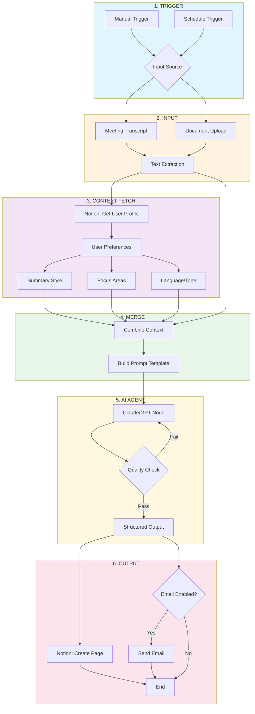

# n8n Workflow: Personalized Summary Agent

## Workflow Diagram



---

## Node Reference

| # | Node | Purpose | Key Config |
|---|------|---------|------------|
| 1 | **Trigger** | Initiates workflow | Manual button or cron schedule |
| 2 | **Input** | Receives raw content | Webhook, file upload, or paste |
| 3 | **Notion Get** | Fetches user profile | Database ID + User ID filter |
| 4 | **Merge** | Combines transcript + preferences | Expression: `{{ $json.transcript }}` + `{{ $('Notion').item.json }}` |
| 5 | **AI Agent** | Processes with LLM | System prompt with persona + user prefs |
| 6a | **Notion Create** | Writes summary | Target database + property mapping |
| 6b | **Email** | Optional notification | Conditional on user preference |

---

## Configuration Notes

### Notion Integration
```
Database Properties Required:
- Title (text)
- Summary (rich_text)
- Source (select)
- Created (date)
- User (relation)
```

### AI Agent Prompt Structure
```
SYSTEM: You are a summary assistant. Adapt your output to:
- Style: {{ $json.user.summary_style }}
- Focus: {{ $json.user.focus_areas }}
- Length: {{ $json.user.preferred_length }}

USER: Summarize this transcript:
{{ $json.transcript }}
```

### Error Handling
- Retry loop on AI node (max 2 attempts)
- Fallback: Write raw transcript if AI fails
- Logging: Store all runs in separate Notion DB

---

## Why This Pattern Works

1. **Separation of concerns** - User prefs live in Notion, not hardcoded
2. **Reusable** - Same workflow handles any document type
3. **Auditable** - Every summary stored with source reference
4. **Extensible** - Add Slack, Teams, or webhook outputs easily

---

*For GAMMA slides: Use the Mermaid diagram as a visual, the table as speaker notes.*
