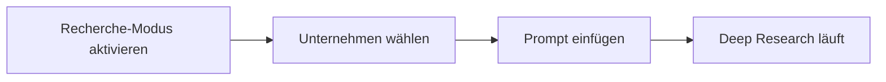

# Company Research

**Duration:** 20 min (+ optional 15 min strategy synthesis)
**Tools:** Claude Pro (research mode) | Perplexity Pro | ChatGPT with web search
**Deliverable:** Board-ready company analysis with sources
**Status:** proven
**Used in:** 2026_02_07_AIF

---

> In 20 Minuten eine Deep-Research-Analyse starten, die du in einem Kundengespräch oder einer Vorstandssitzung verwenden könntest.



---

## Los geht's

### 1. Wähle dein Unternehmen

| Option | Wann sinnvoll |
|--------|---------------|
| **Dein eigenes Unternehmen** | Wie sieht der Markt dich? Blinde Flecken in der Positionierung? |
| **Ein Wettbewerber** | Deren Strategie, Preise, Schwächen |
| **Ein Kunde oder Prospect** | Pain Points, Entscheidungskriterien, Budgetsignale |

### 2. Öffne Claude und aktiviere den Recherche-Modus

Gehe zu [claude.ai](https://claude.ai) und starte eine neue Konversation.

**Wichtig:** Klicke auf das **Lupen-Icon** neben dem Eingabefeld, um den **Recherche-Modus** zu aktivieren. Nur so durchsucht Claude das Web systematisch und liefert aktuelle Daten mit Quellenangaben.

Alternativ funktioniert auch Perplexity Pro oder ChatGPT mit Websuche.

### 3. Kopiere den Prompt

Kopiere den **Deep Research Prompt** (weiter unten) und ersetze die drei Platzhalter (`[COMPANY NAME]`, `[INDUSTRY]`, `[COUNTRY/REGION]`) mit deinem Zielunternehmen.

> **Der Prompt ist auf Englisch** — das liefert bessere Rechercheergebnisse. Die AI antwortet auf Deutsch mit Schweizer Orthografie.

### 4. Lass die Recherche laufen

Die Deep Research braucht einige Minuten. Claude durchsucht systematisch das Web und baut das Briefing auf. Du erhältst:

- Executive Summary mit Confidence-Ratings
- Business Model Deep Dive
- Produkte- und Wettbewerbertabellen
- SWOT-Analyse
- Porter's Five Forces
- **AI-Disruptions-Analyse** — Risiken, Chancen und Strategie-Empfehlungen
- Risiko-Flags und Datenlücken

### 5. Prüfe das Ergebnis

Prüfe das Briefing kritisch:
- Stimmen die Fakten? (Klicke auf die Quellen)
- Fehlt etwas Wichtiges?
- Sind Schätzungen als solche markiert?

> **Tipp:** Falls der Output zu oberflächlich ist, frag nach: *"Geh tiefer auf [Abschnitt]. Belege mit mindestens 3 Quellen."*

---

## Was du am Ende hast

- **Executive Summary** — teilbar mit der Führungsebene
- **Produktetabelle** — Stärken, Schwächen, Pricing auf einen Blick
- **Wettbewerbermatrix** — Positionierung im Markt
- **SWOT-Analyse** — interne Stärken/Schwächen, externe Chancen/Risiken
- **Porter's Five Forces** — Wettbewerbsdynamik des Marktes
- **AI-Disruptions-Analyse** — wo AI diese Branche verändert und was das für das Unternehmen bedeutet
- **Risikohinweise** — mit Quellenbelegen
- **Zitationsnachweis** — jede Aussage durch 1+ Quellen gestützt

---

## Bonus: Strategie-Synthese

Wenn du dein Recherche-Ergebnis in ein vorstandsreifes Strategiedokument verwandeln willst:

1. Öffne Claude oder ChatGPT
2. Füge dein Recherche-Ergebnis ein
3. Füge den **Strategie-Synthese Prompt** (weiter unten) darunter ein
4. Du erhältst: Golden Circle + Business Model Canvas + Value Proposition Canvas

Zeitaufwand: 10-15 Minuten zusätzlich.

---

---

## Prompt 1: Deep Research

> Kopiere alles unterhalb dieser Linie und füge es in Claude Pro, Perplexity Pro oder ein anderes AI-Tool mit Websuche ein.

**Wichtig:** Aktiviere in Claude den **Recherche-Modus** (das Lupen-Icon neben dem Eingabefeld). Nur so durchsucht Claude das Web systematisch. Ohne Recherche-Modus bekommst du keine aktuellen Daten und Quellen.

```
You are a senior corporate strategist producing a McKinsey-style deep research briefing.

**INPUTS (fill these in):**
- **Company:** [COMPANY NAME]
- **Primary domain:** [INDUSTRY OR WEBSITE]
- **Geo focus:** [COUNTRY/REGION]

**Language:** Respond entirely in German. Use Swiss German orthography (ss instead of ß).

**Output limit:** Maximum 30,000 words. This is a deep research document — be thorough, not brief. Use the full output budget.

---

## Research Protocol (in order)

1. **Company-owned sources:** website, product pages, pricing, newsroom, leadership bios, job posts
2. **Official registries:** SEC/Companies House/local equivalent, trademark databases
3. **Third-party data:** Crunchbase, LinkedIn, G2/Capterra, Glassdoor, Similarweb
4. **Media/analyst coverage:** business press, trade publications, conference mentions
5. **Industry reports:** market sizing, competitive landscape, regulatory environment

---

## Deliverables

### Executive Summary (6-10 bullets max)
- What they do, who they serve, where they win/lose
- 3 opportunities, 3 risks
- Key metrics: revenue band, headcount band, growth signal, funding status
- Mark confidence: High/Med/Low for each headline

### Business Model Deep Dive
- Revenue streams & pricing model
- Cost structure signals
- Moat sources (IP, data, switching costs, distribution)

### Products & Solutions Table

| Product | Overview | Strengths | Weaknesses | Ideal Customer | Pricing |
|---------|----------|-----------|------------|----------------|---------|
| ... | ... | ... | ... | ... | ... |

### Competition Snapshot

| Competitor | Position | Strength | Weakness | Pricing Posture |
|------------|----------|----------|----------|-----------------|
| ... | ... | ... | ... | ... |

### SWOT Analysis

Provide a detailed SWOT analysis:

| | Positive | Negative |
|---|----------|----------|
| **Internal** | **Strengths:** Core competencies, unique resources, competitive advantages | **Weaknesses:** Operational gaps, resource constraints, known vulnerabilities |
| **External** | **Opportunities:** Market trends, expansion potential, partnership options | **Threats:** Competitive pressure, regulatory risk, market shifts |

For each quadrant, provide 5-8 substantiated points with evidence from the research.

### Porter's Five Forces Analysis

Analyze the competitive dynamics of the company's primary market:

1. **Threat of New Entrants** — Barriers to entry, capital requirements, regulatory hurdles, brand loyalty, network effects
2. **Bargaining Power of Suppliers** — Supplier concentration, switching costs, input differentiation, forward integration threat
3. **Bargaining Power of Buyers** — Buyer concentration, price sensitivity, switching costs, information availability
4. **Threat of Substitutes** — Alternative solutions, price-performance trade-off, switching costs, buyer propensity to substitute
5. **Competitive Rivalry** — Number and strength of competitors, industry growth rate, differentiation, exit barriers

Rate each force as Low / Medium / High with justification and evidence.

### AI Disruption Analysis

This is a critical section. Analyze in depth:

**Current AI Exposure:**
- Which business processes are most vulnerable to AI disruption?
- Where are competitors already deploying AI?
- What is the company's current AI maturity level?

**Disruption Risks:**
- Which revenue streams could be disrupted by AI-powered alternatives?
- Which roles or departments face automation risk?
- What happens if a competitor achieves AI-driven cost advantage?
- Regulatory risks from AI adoption or non-adoption

**AI Opportunities:**
- Where could AI create new revenue streams or business models?
- Which operational inefficiencies could AI eliminate?
- How could AI improve customer experience or product quality?
- What AI-powered services could be offered to existing customers?

**Mitigation & Strategy Recommendations:**
- Priority AI initiatives (quick wins vs. strategic bets)
- Build vs. buy vs. partner recommendations
- Talent and organizational readiness assessment
- Timeline: what should happen in 6 months, 12 months, 3 years?

### Key Risks & Flags
- Legal/regulatory exposure
- Financial health signals
- Leadership/culture red flags
- Technology debt or platform risk

### Data Gaps
- What couldn't be verified
- Questions for management/sales calls

---

## Quality Rules

- **Cite every material claim** with (Source, Date) and link
- **No speculation** - mark estimates as [Est.] and show method
- **If sources conflict**, present both and state which you weight more
- **Numbers over adjectives** - "30% growth" not "rapid growth"
- **If no data found**, say exactly: "No reliable public data found."
- **Be exhaustive** - this is deep research, not a summary. Use the full output budget.
```

---

## Prompt 2: Strategy Synthesis (Bonus)

> **Das ist der optionale zweite Schritt.** Du brauchst dafür das Ergebnis aus der Unternehmensrecherche (Prompt 1).

### So geht's

1. Öffne Claude oder ChatGPT
2. Füge dein Recherche-Ergebnis aus Schritt 1 ein
3. Füge den Prompt unten direkt darunter ein
4. Enter drücken

> Kopiere alles unterhalb dieser Linie.

```
You are a senior, McKinsey-level strategy consultant. Using the research provided above, produce a **board-ready strategy document** that integrates the Golden Circle, Business Model Canvas, and Value Proposition Canvas.

**Language:** Respond entirely in German. Use Swiss German orthography (ss instead of ß).

**Output limit:** Maximum 10,000 words. Be thorough — this is a board-level strategy document, not a summary.

**Opening Requirement:**
Begin with a **one-sentence executive maxim** — a crisp, authoritative quote capturing the strategic thesis.

**Output Rules:**
- Consulting report style: clear headings, numbered subsections, concise paragraphs
- Each subsection starts with a 1-2 sentence executive summary, then detail
- Neutral, professional tone suitable for executives and boards
- Ground assertions in the research; mark unknowns as "TBD" with explicit assumptions
- Ensure Golden Circle ↔ BMC ↔ VPC are mutually consistent

**Visual Requirements:**
Generate actual images (not code diagrams) for key frameworks. Create each as a professional, board-ready visual:
- Business Model Canvas (9-block layout with key points filled in)
- Value Proposition Canvas (customer profile ↔ value map)
- Strategic positioning map (competitive landscape with company + competitors plotted)
- SWOT matrix (2×2 grid with key findings)

Use clean, professional styling suitable for a strategy presentation. Always produce the full text analysis first, then generate the image as a visual summary. The text is authoritative — the image is a supplement for presentations. (AI-generated images sometimes contain text errors.)

---

### Part 1 — Golden Circle

**1. Why**
- Core statement: Single-sentence purpose
- Elaboration: Strategic implications (positioning, customer promise, culture)

**2. How**
- Core statement: Signature capabilities and principles
- Elaboration: Operating model, differentiators, proof points

**3. What**
- Core statement: Offerings and business scope
- Elaboration: Products/services and customer outcomes

---

### Part 2 — Business Model Canvas

For each of the nine blocks, provide a 1-2 sentence summary, then expand with concise bullets:

1. **Key Partners** — Critical alliances and supplier relationships
2. **Key Activities** — Core operations that make the model work
3. **Key Resources** — Assets required to deliver value
4. **Value Propositions** — The bundle of benefits for each segment
5. **Customer Relationships** — How the company acquires, retains, grows customers
6. **Channels** — How value reaches customers
7. **Customer Segments** — Who the company serves (and who it doesn't)
8. **Cost Structure** — Major cost drivers and economics
9. **Revenue Streams** — How the company monetizes

Mark financial unknowns as **TBD** and specify what evidence would resolve them.

Generate an image of the completed 9-block Business Model Canvas.

---

### Part 3 — Value Proposition Canvas

**Customer Profile:**
- **Jobs to be Done** — Functional, emotional, and social jobs customers are trying to accomplish
- **Pains** — Obstacles, risks, and frictions (prioritize severe and frequent)
- **Gains** — Desired outcomes (distinguish must-haves from delighters)

**Value Map:**
- **Products & Services** — Offerings mapped to specific jobs
- **Pain Relievers** — How the offer removes key pains (be explicit)
- **Gain Creators** — How the offer enables gains (link to measurable outcomes)

**Conclude with a Fit Statement (2-3 sentences):** Summarize how Pain Relievers and Gain Creators address the most critical Jobs/Pains/Gains.

Generate an image of the Value Proposition Canvas showing the customer profile ↔ value map fit.

---

### Part 4 — Strategic Recommendations

Based on the complete analysis:

1. **Top 3 Strategic Priorities** — What the board should focus on in the next 12 months
2. **Key Risks to Mitigate** — Ranked by probability × impact
3. **AI Readiness Assessment** — Based on the AI disruption analysis from the research
4. **Investment Thesis** — Why this company is/isn't well-positioned for the next 3-5 years

---

Now analyze the research above and produce the strategy document with supporting visualizations.
```
