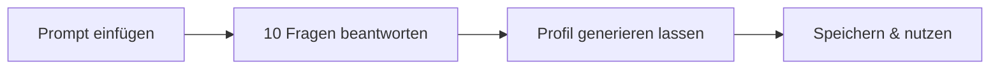

# Writing Profile

**Duration:** 20 min
**Tools:** Claude Pro (primary) | ChatGPT Plus | Gemini Advanced
**Deliverable:** Voice profile document that teaches any AI how you sound
**Status:** proven
**Used in:** 2026_02_07_AIF, 2026_02_14_Chicks_AI

---

> Eine AI interviewt dich zu deinem Schreibstil. Am Ende hast du ein Dokument, das jeder AI beibringt, wie du klingst.

---

## Anleitung

### 1. Kopiere den Prompt

Öffne [prompts/lite-interview.md](./prompts/lite-interview.md) und kopiere **alles unterhalb der horizontalen Linie** (den gesamten Prompt-Text).

### 2. Starte eine neue AI-Konversation

Öffne [claude.ai](https://claude.ai) und starte eine neue Konversation. Falls du kein Claude hast, funktioniert auch ChatGPT oder eine andere AI.

### 3. Füge den Prompt ein und leg los

Füge den kopierten Text ein und drücke Enter. Die AI stellt dir 10 Fragen, eine nach der anderen. Beantworte jede ehrlich und konkret.

> **Tipp:** Vage Antworten wie "Ich halte es gerne einfach" produzieren generische Profile. Was zählt: konkrete Beispiele, echte Ärgernisse, spezifische Wörter die du hasst. Je ehrlicher, desto besser das Ergebnis.

> **Zeit knapp?** Kein Problem. Schreib "Profil erstellen" in den Chat — die AI erstellt das Profil mit dem, was du bis dahin beantwortet hast. Du kannst jederzeit später zurückkommen und die restlichen Fragen nachholen. Das Profil wird mit jeder Runde besser.

### 4. Speichere dein Profil

Nach der letzten Frage generiert die AI dein Stimmprofil. So speicherst du es:

**In Claude:**
1. Das Profil erscheint als Artifact (rechte Seite)
2. Klicke auf das Kopier-Symbol oben rechts im Artifact
3. Öffne einen Texteditor (z.B. Notepad, VS Code, oder was du hast)
4. Füge den Text ein und speichere als `stimmprofil.md`

**In ChatGPT:**
1. Markiere den gesamten Profiltext im Chat
2. Kopiere mit Ctrl+C / Cmd+C
3. Füge in einem Texteditor ein und speichere als `stimmprofil.md`

### 5. Setze dein Profil ein

Füge dein Stimmprofil dort ein, wo die AI es bei jeder Konversation sieht:

- **Claude:** Erstelle ein Projekt und füge das Profil in die Projektanweisungen ein
- **ChatGPT:** Erstelle ein Projekt oder hinterlege es als Custom Instructions

Ab jetzt kennt die AI deinen Stil.

---

## Was du am Ende hast

- **Kernidentität** — 2-3 Sätze, die dein Schreiben auf den Punkt bringen
- **Verbotene Wörter** — was die AI nie verwenden darf
- **Tonale Marker** — wie du klingst wenn du skeptisch bist vs. begeistert
- **Kurzreferenz** — Immer / Niemals / Stimmkalibrierung

---

## Für Neugierige: Das vollständige Interview

Die 10 Fragen decken ~80% deines Schreibstils ab. Wer tiefer einsteigen will, kann das vollständige 100-Fragen-Interview machen:

- **Von Null starten:** Öffne [prompts/full-interview.md](./prompts/full-interview.md) und kopiere den Prompt in eine neue Konversation. Das Interview führt dich durch alle 100 Fragen.
- **Vom LITE-Profil aus erweitern:** Nutze [prompts/bridge-to-full.md](./prompts/bridge-to-full.md), wenn du die LITE-Übung oben bereits gemacht hast und dein bestehendes Profil vertiefen willst.
- **Zeitaufwand:** 2–3 Stunden zusätzlich (am besten in mehreren Sitzungen)

Das lohnt sich nur, wenn du ernsthaft AI-Ghostwriting betreibst oder einen dauerhaften Schreibassistenten aufbauen willst. Für die meisten reicht die LITE-Version.

---

## Files

| File | Purpose |
|------|---------|
| [prompts/lite-interview.md](./prompts/lite-interview.md) | 10-question interview (20 min) |
| [prompts/full-interview.md](./prompts/full-interview.md) | 100-question deep interview (2-3 hours) |
| [prompts/bridge-to-full.md](./prompts/bridge-to-full.md) | Upgrade from lite to full |
| [guides/platform-guide.md](./guides/platform-guide.md) | How to save and use your profile |
| [guides/question-analysis.md](./guides/question-analysis.md) | Why each question works |
